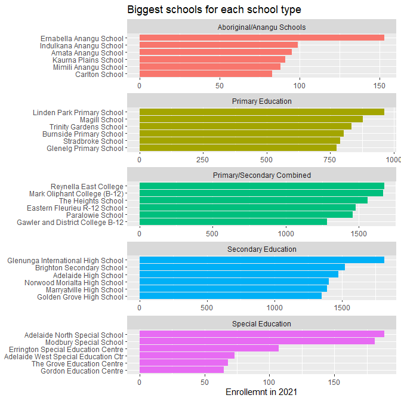
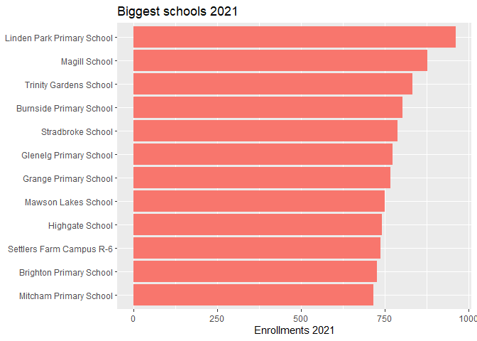

Shiny education
================
Owen
22/03/2022

# Why shiny?

Do you ever want to give a non-programmer the ability to investigate a
data-set themselves? Sometimes sharing insights with decision makers can
be made more persuasive if the decision makers can do some of the
investigations themselves.

*R Shiny* bridges the gap between an analyst who is working in R and a
decision maker who doesn’t program but want to explore the data. A Shiny
application uses standard R analytic programming and then builds an HTLM
interface that can be interacted with through a web browser.

# Quick start

Let’s build a Shiny application that addresses the problem **“What are
the biggest schools by enrollment for each school type?”**.

## A non-shiny approach

If we were not using Shiny we could provide a static image such as this:

``` r
library(readr)
library(tidyverse)

X8_sa_enrolment_by_school <- read_csv("https://data.sa.gov.au/data/dataset/d385385a-6d79-4ef7-ab0f-0cfc583469f6/resource/7223f681-d340-4fc9-b92b-403d158f521f/download/8-sa-enrolment-by-school-.csv")

X8_sa_enrolment_by_school %>%
  group_by(School_Type) %>%
  slice_max(order_by = Year_2021, n = 6) %>%
  ungroup() %>%
  ggplot(aes(x = Year_2021, 
             y = fct_reorder(School_Name, Year_2021), 
             fill = School_Type)) + 
  geom_col(show.legend = FALSE) + 
  facet_wrap(~School_Type, 
             scales = "free", 
             ncol = 1) + 
  labs(title = "Biggest schools for each school type", x = "Enrollemnt in 2021", y = NULL)
```

<!-- -->

But what if we could give decision makers an interactive webpage where
they could select the school type and the plot would render to show what
they had selected?

## Anatomy of a shiny app

If you open RStudio and go to *File \> New File \> Shiny Web App* you
can name your new application. This actually creates a new directory
with the name you chose. In that directory is a standard R file called
`app.R`. It has an example Shiny app already written there to show you
how to get started.

### A tale of two code sections

There are two parts to every `app.R` file: `ui` and `server`. The `ui`
sets out how the user interface will look and feel and defines the
objects that the user will select. The `server` contains all the R
analysis that is done in the background. It is written in the form of a
R function (within curly brackets) and contains at least one expression
that is also within curly brackets which *reacts* to the user’s input.

### ui

The layout we might want could include three sections:

-   Title
-   User interface
-   Resultant plot

``` r
ui <- fluidPage(
  
  titlePanel(),
  
  sidebarLayout(
    sidebarPanel(
    )
  ),
  
  mainPanel(
  )
)
```

We can then fill in each section:

-   Title: A string in the `titlePanel()` section
-   User interface: Some `radioButtons()` to select one of the levels of
    `X8_sa_enrolment_by_school$School_Type` in the `sidebarPanel()`
    section.
-   Resultant plot: A named `plotOutput()` in the `mainPanel()` section.

``` r
ui <- fluidPage(

    titlePanel("Biggest schools by enrollment"),

    # Sidebar with a slider input for number of bins 
    sidebarLayout(
        sidebarPanel(
          radioButtons("selected_type",
                        "Type of school",
                       unique(X8_sa_enrolment_by_school$School_Type)
          )
        ),

        mainPanel(
           plotOutput("biggestPlot")
        )
    )
)
```

### server

The `server` section is really just a R function

``` r
server <- function(input, output) {

}
```

The only thing we have to put in here is the code that creates
`biggestPlot` which we are calling back in the `ui` section. And as part
of that code, we have to let the plot be updated based on the user’s
selection of the `selected_type`.

If we were just creating a plot to show one `School_Type` we could use
`filter()` like this:

``` r
      X8_sa_enrolment_by_school %>%
        filter(School_Type == "Primary Education") %>%
        slice_max(order_by = Year_2021, n = 12) %>%
        ggplot(aes(x = Year_2021, 
                   y = reorder(School_Name, Year_2021), 
                   fill = School_Type)) + 
        geom_col(show.legend = FALSE) + 
  labs(title = "Biggest schools 2021", x = "Enrollments 2021", y = NULL)
```

<!-- -->

#### Updating from inputs

So all we have to do is replace the `"Primary Education"` with the
user’s selection of `selected_type` in the `ui`.

When it is run, Shiny creates a temporary object called `input` which
stores the currently selected values of all the user inputs. We access
them using the standard R `$` notation and the name we assigned the
inputs in the `ui`. Hence, we can replace `"Primary Education"` with
`input$selected_type`

#### Creating the plot

To ensure that the whole analysis is reactive to the user’s input we
need to put it in curly brackets itself and output the whole operation
to an object named `biggestPlot` which we called in the `ui` section. We
do this using the `renderPlot()` function and send it to another
temporary object called `output`.

``` r
server <- function(input, output) {

    output$biggestPlot <- renderPlot({

      X8_sa_enrolment_by_school %>%
        filter(School_Type == input$selected_type) %>%
        slice_max(order_by = Year_2021, n = 12) %>%
        ggplot(aes(x = Year_2021, 
                   y = reorder(School_Name, Year_2021), 
                   fill = School_Type)) + 
        geom_col()
        
    })
}
```

### Wrapping it all up

There are actually three other things to remember to put in an `app.R`
file.

1.  The final line which is `shinyApp(ui = ui, server = server)`.
2.  All the `library()` calls needed to create all the functions that
    are used in the app. These should be above the `ui` section so that
    they are available to all the code below.
3.  The data that is used. This should also be placed above the `ui`
    section because it is used in both the `ui` and `server` sections.

Putting it all together we get:

``` r
library(shiny)
library(readr)
library(tidyverse)

X8_sa_enrolment_by_school <- read_csv("https://data.sa.gov.au/data/dataset/d385385a-6d79-4ef7-ab0f-0cfc583469f6/resource/7223f681-d340-4fc9-b92b-403d158f521f/download/8-sa-enrolment-by-school-.csv")

ui <- fluidPage(

    titlePanel("Biggest schools by enrollment"),

    # Sidebar with a slider input for number of bins 
    sidebarLayout(
        sidebarPanel(
          radioButtons("selected_type",
                        "Type of school",
                       unique(X8_sa_enrolment_by_school$School_Type)
          )
        ),

        mainPanel(
           plotOutput("biggestPlot")
        )
    )
)

server <- function(input, output) {

    output$biggestPlot <- renderPlot({

      X8_sa_enrolment_by_school %>%
        filter(School_Type == input$selected_type) %>%
        slice_max(order_by = Year_2021, n = 12) %>%
        ggplot(aes(x = Year_2021, 
                   y = reorder(School_Name, Year_2021), 
                   fill = School_Type)) + 
        geom_col(show.legend = FALSE) + 
        labs(title = "Biggest schools 2021", x = "Enrollments 2021", y = NULL)
        
    })
}

# Run the application 
shinyApp(ui = ui, server = server)
```

## Check it out

You can run the app by clicking on the “Run App” button in the ribbon at
the top of the top left panel in RStudio. This will launch a browser
that runs the app localy on your computer. It should look like the app
here: <https://ofchurches.shinyapps.io/biggest_schools/>.
